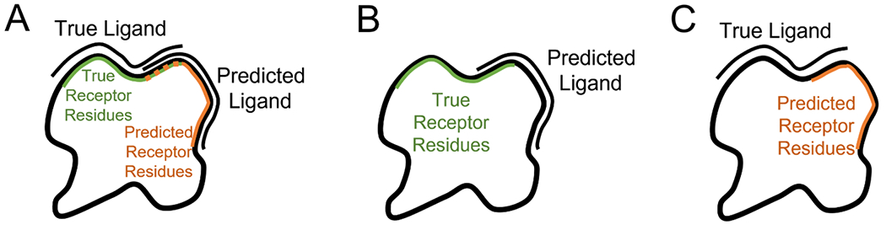
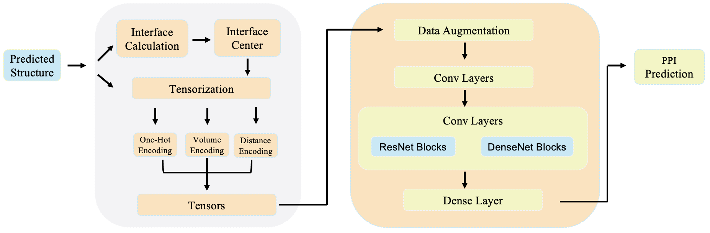
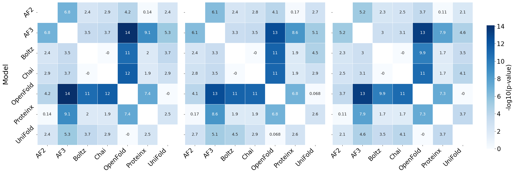
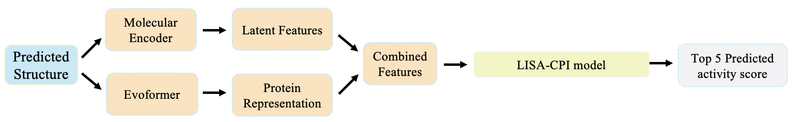
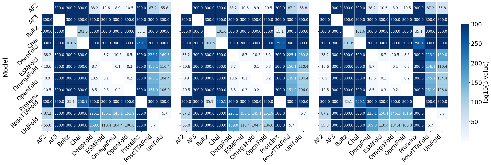

# 🚀 `DisProtBench`:  Disorder-Aware, Task-Rich Benchmark for Evaluating Protein Structure Prediction in Realistic Biological Contexts

**Xinyue Zeng¹**, **Tuo Wang¹**, **Adithya Kulkarni¹**, **Alexander Lu¹**, **Alexandra Ni¹**, **Phoebe Xing¹**, **Junhan Zhao²³**, **Siwei Chen⁴⁵**, **Dawei Zhou¹**

¹ Virginia Tech, ² Harvard Medical School, ³ Harvard T.H. Chan School of Public Health, ⁴ Broad Institute of MIT and Harvard, ⁵ Massachusetts General Hospital

<!-- Stylish Buttons -->

  

---

## 📌 Abstract
Recent advances in protein structure prediction have achieved near-atomic accuracy for well-folded proteins. However, current benchmarks inadequately assess model performance in biologically challenging contexts, especially those involving intrinsically disordered regions (IDRs), limiting their utility in applications like drug discovery, disease variant interpretation, and protein interface design. We introduce DisProtBench, a comprehensive benchmark for evaluating protein structure prediction models (PSPMs) under structural disorder and complex biological conditions. DisProtBench spans three key axes: 

(1) **Data complexity**—covering disordered regions, G protein-coupled receptors (GPCR)–ligand pairs, and multimeric complexes; 

(2) **Task diversity**—benchmarking twelve leading PSPMs across structure-based tasks with unified classification, regression, and interface metrics; 

(3) **Interpretability**—via the [DisProtBench Portal](http://zhoulab-1.cs.vt.edu:8501/), offering precomputed 3D structures and visual error analyses. 

Our results reveal significant variability in model robustness under disorder, with low-confidence regions linked to functional prediction failures. Notably, global accuracy metrics often fail to predict task performance in disordered settings, emphasizing the need for function-aware evaluation. DisProtBench establishes a reproducible, extensible, and biologically grounded framework for assessing next-generation PSPMs in realistic biomedical scenarios.

### 🔹 `DisProtBench` - A Unified Benchmark for IDR Investigation
We introduce DisProtBench with the following key contributions:

(1) **Database Development:** We curate a large benchmark dataset spanning biologically complex IDR scenarios, including thousands of disease-associated human proteins, GPCR–ligand interactions, and multimeric complexes with disorder-mediated interfaces. It captures structural heterogeneity essential for assessing model robustness in realistic contexts.

(2) **Task and Toolbox Development:** We introduce a unified evaluation toolbox to benchmark eleven PSPMs on disorder-sensitive tasks, using consistent metrics across PPI prediction, ligand binding, and contact mapping. Incorporating pLDDT-based stratification, DisProtBench uniquely isolates model behavior in ambiguous regions across tasks and model families.

(3) **Visual-Interactive Interface Development:** The DisProtBench Portal provides 3D visualizations, model comparison heatmaps, and interactive results to explore structure–function links, assess disorder-specific performance, and support hypothesis generation—without local setup.

## 📂 Datasets
We open-sourced our benchmark on [Kaggle](https://doi.org/10.34740/kaggle/ds/7400098), consisting of the following subsets:

| **Dataset**                  | **Description**                   | **# Number of Protein Only** | **Source**                                                                 |
|-----------------------------|-----------------------------------|---------------|---------------------------------------------------------------------------|
| **DisProt-Based Dataset**   | Disorder in human disease         | 3,060         | First proposed in our work                                                |
| **Protein Interaction Dataset** | Disorder-mediated interfaces      | 1,200         | [GitHub](https://github.com/ohuelab/SpatialPPI/tree/main)                |
| **Individual Protein Dataset** | Disorder and ligand binding       | 20            | [GitHub](https://github.com/ChengF-Lab/LISA-CPI?tab=readme-ov-file)       |
              
## 🏗️ Toolbox
### 📂 Models Toolbox
We benchmark state-of-the-art PSPMs spanning diverse architectures, inputs, and structural representations across protein-related tasks, as summarized below:

| **PSPM**       | **Task**       | **Architecture**     | **Input**       | **Source**         | **Structural Representation**                |
|----------------|----------------|-----------------------|------------------|---------------------|------------------------|
| AF2            | PPI, Drug      | Evoformer             | MSA              | [Paper](https://www.nature.com/articles/s41586-021-03819-2)            | Atomic                 |
| AF3            | PPI, Drug      | Evoformer+LLM         | MSA + Seq        | [Paper](https://www.nature.com/articles/s41586-024-07487-w)            | Atomic + ligand        |
| OpenFold       | PPI, Drug      | Evoformer             | MSA              | [Paper](https://www.nature.com/articles/s41592-024-02272-z)               | Atomic                 |
| UniFold        | PPI, Drug      | Evoformer             | MSA              | [Paper](https://www.biorxiv.org/content/10.1101/2022.08.04.502811v3)        | Atomic                 |
| Boltz          | PPI, Drug      | Transformer           | Seq-only         | [Paper](https://www.biorxiv.org/content/10.1101/2024.11.19.624167v4)      | Coarse-grained         |
| Chai           | PPI, Drug      | Transformer           | Seq-only         | [Paper](https://www.biorxiv.org/content/10.1101/2024.10.10.615955v1)      | Coarse-grained         |
| Protenix       | PPI, Drug      | Transformer+          | Seq-only         | [Paper](https://www.biorxiv.org/content/10.1101/2025.01.08.631967v1)           | Atomic + ligand        |
| ESMFold        | Drug           | Transformer           | Seq-only         | [Paper](https://www.biorxiv.org/content/10.1101/2022.07.20.500902v3)             | Coarse-grained         |
| OmegaFold      | Drug           | Transformer           | Seq-only         | [Paper](https://www.biorxiv.org/content/10.1101/2022.07.21.500999v1)             | Coarse-grained         |
| RoseTTAFold    | Drug           | Hybrid (CNN+Attn)     | MSA              | [Paper](https://pubmed.ncbi.nlm.nih.gov/34282049/)           | Atomic                 |
| DeepFold       | Drug           | Custom DL             | Seq-only         | [Paper](https://pubmed.ncbi.nlm.nih.gov/37995286/)       | Atomic                 |

### 📊 Evaluation ToolBox
We evaluate model performance using a comprehensive set of classification, regression, and structural interface metrics, defined as follows:

  
| **Metric**                         | **Definition / Formula**                                                                                       |
|-----------------------------------|---------------------------------------------------------------------------------------------------------------|
| **Classification Metrics**        |                                                                                                               |
| Precision (Positive Predictive Value) | TP / (TP + FP)                                                                                             |
| Recall (Sensitivity)              | TP / (TP + FN)                                                                                               |
| F1 Score                          | 2 × TP / (2 × TP + FP + FN)                                                                                  |
| Accuracy                          | (TP + TN) / (TP + TN + FP + FN)                                                                              |
| **Regression Metrics**            |                                                                                                               |
| Mean Absolute Error (MAE)         | (1/N) × Σ |yᵢ − ŷᵢ|                                                                                         |
| Mean Squared Error (MSE)          | (1/N) × Σ (yᵢ − ŷᵢ)²                                                                                        |
| Pearson Correlation Coefficient (R) | Σ[(yᵢ − ȳ)(ŷᵢ − ŷ̄)] / √(Σ(yᵢ − ȳ)² × Σ(ŷᵢ − ŷ̄)²)                                                           |
| **Structural Interface Metrics**  |                                                                                                               |
| Receptor Precision (RP)           | `size(True ∩ Pred Receptor) / size(Pred Receptor)`                                                                    |
| Receptor Recall (RR)              | `size(True ∩ Pred Receptor) / size(True Receptor)`                                                                    |
| Ligand Precision (LP)             | `size(Pred Ligand ∩ True Receptor) / size(Pred Ligand)`                                                            |
| Ligand Recall (LR)                | `size(True Ligand ∩ Pred Receptor) / size(True Ligand)`                                                         |

For the definitions of Receptor and Ligand, we follow the work of [*Multi-level analysis of intrinsically disordered protein docking methods*](https://pubmed.ncbi.nlm.nih.gov/35609776/):

  

## 🎨 Visualize Portal
For more visualizations please link to 

🔗 **Visual-Interactive Interface**: [DisProtBench](http://zhoulab-1.cs.vt.edu:8501/) 

  

## 🏗️ Results
### PPI Prediction
We use PPI prediction as a downstream task for evaluating PSPMs with the following pipeline:

  

We examine the robustness of PSPMs in predicting PPI, a setting where disordered regions frequently mediate transient or flexible binding. The results are as follows:

  
|          | **Original** |          |         |        | **pLDDT ≥ 30** |          |         |        | **pLDDT ≥ 50** |          |         |        |
| -------- | ------------ | -------- | ------- | ------ | -------------- | -------- | ------- | ------ | -------------- | -------- | ------- | ------ |
| **PSPM** | **Acc**      | **Prec** | **Rec** | **F1** | **Acc**        | **Prec** | **Rec** | **F1** | **Acc**        | **Prec** | **Rec** | **F1** |
| AF2      | 0.793        | 0.783    | 0.799   | 0.791  | 0.802          | 0.791    | 0.812   | 0.801  | 0.818          | 0.809    | 0.825   | 0.817  |
| AF3      | 0.900        | 0.888    | 0.915   | 0.901  | 0.905          | 0.893    | 0.905   | 0.906  | 0.913          | 0.899    | 0.930   | 0.914  |
| Boltz    | 0.850        | 0.848    | 0.853   | 0.850  | 0.858          | 0.853    | 0.863   | 0.858  | 0.869          | 0.870    | 0.868   | 0.869  |
| Chai     | 0.850        | 0.841    | 0.863   | 0.852  | 0.858          | 0.847    | 0.873   | 0.860  | 0.869          | 0.857    | 0.887   | 0.871  |
| OpenFold | 0.624        | 0.605    | 0.605   | 0.605  | 0.643          | 0.622    | 0.638   | 0.630  | 0.671          | 0.656    | 0.651   | 0.653  |
| Proteinx | 0.810        | 0.809    | 0.812   | 0.810  | 0.819          | 0.820    | 0.818   | 0.819  | 0.834          | 0.834    | 0.835   | 0.834  |
| UniFold  | 0.552        | 0.378    | 0.667   | 0.483  | 0.567          | 0.389    | 0.667   | 0.491  | 0.597          | 0.417    | 0.714   | 0.526  |

**Heatmaps** of -log10(p) values from McNemar tests comparing pairwise model performance on PPI prediction across different pLDDT thresholds. **Left**: full sequence; **Middle**: pLDDT ≥ 30; **Right**: pLDDT ≥ 50. Higher values indicate greater statistical significance between PSPMs. Blank blocks indicate self-comparisons, which are omitted by definition.

  

### Drug Discovery
We use drug discovery as a downstream task for evaluating PSPMs with the following pipeline:

  

We examine the robustness of PSPMs in discovering drug, a setting where disordered regions frequently mediate transient or flexible binding. The results are as follows:

  
|             | **Original** |       | **pLDDT ≥ 30** |       | **pLDDT ≥ 50** |       |
| ----------- | ------------ | ----- | -------------- | ----- | -------------- | ----- |
| **Model**   | **MAE**      | **R** | **MAE**        | **R** | **MAE**        | **R** |
| AlphaFold3  | 0.048        | 0.999 | 0.048          | 0.999 | 0.049          | 0.999 |
| Proteinx    | 0.072        | 0.997 | 0.072          | 0.997 | 0.072          | 0.997 |
| Boltz       | 0.079        | 0.996 | 0.079          | 0.996 | 0.080          | 0.996 |
| Chai        | 0.096        | 0.995 | 0.096          | 0.995 | 0.097          | 0.995 |
| DeepFold    | 0.144        | 0.988 | 0.144          | 0.988 | 0.144          | 0.988 |
| ESMFold     | 0.150        | 0.987 | 0.150          | 0.987 | 0.151          | 0.987 |
| OmegaFold   | 0.151        | 0.987 | 0.151          | 0.987 | 0.152          | 0.987 |
| OpenFold    | 0.151        | 0.987 | 0.151          | 0.987 | 0.151          | 0.987 |
| AlphaFold2  | 0.160        | 0.985 | 0.160          | 0.985 | 0.160          | 0.985 |
| UniFold     | 0.183        | 0.981 | 0.183          | 0.981 | 0.184          | 0.981 |
| RoseTTAFold | 0.190        | 0.979 | 0.190          | 0.979 | 0.190          | 0.979 |

**Heatmaps** of -log10(p) values from Wilcoxon signed-rank tests comparing model performance in drug discovery tasks across different pLDDT thresholds. **Left**: full sequence; **Middle**: pLDDT ≥ 30; **Right**: pLDDT ≥ 50. Higher values indicate greater statistical significance in pairwise differences between PSPMs. Blank blocks indicate self-comparisons, which are omitted by definition.

  

