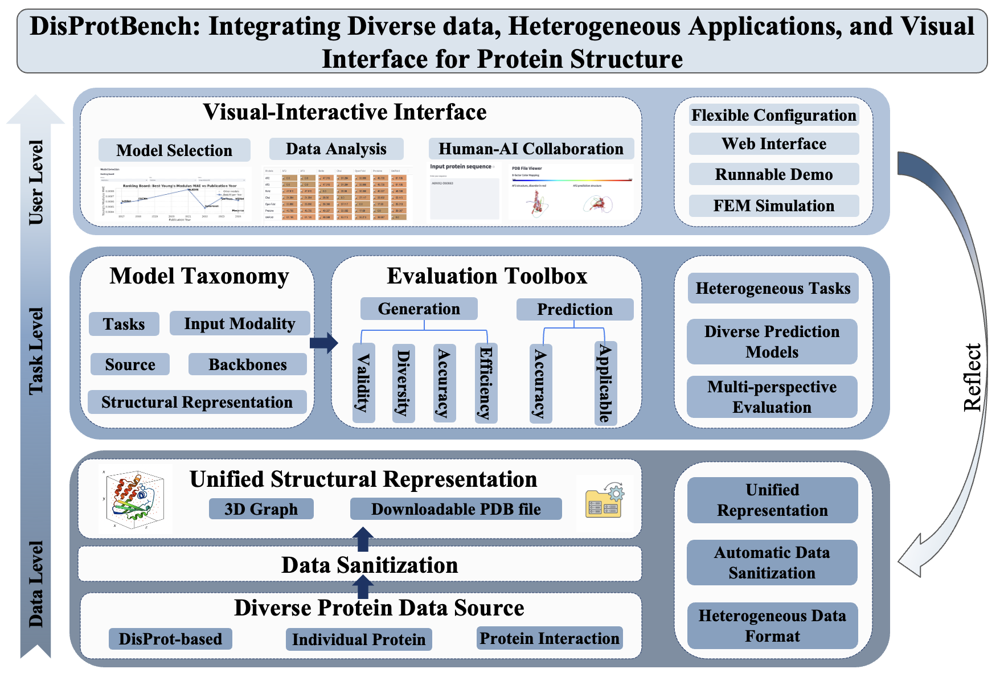

# 🚀 `DisProtBench`:  Disorder-Aware, Task-Rich Benchmark for Evaluating Protein Structure Prediction in Realistic Biological Contexts

**Xinyue Zeng¹**, **Tuo Wang¹**, **Adithya Kulkarni¹**, **Alexander Lu¹**, **Alexandra Ni¹**, **Phoebe Xing¹**, **Junhan Zhao²³**, **Siwei Chen⁴⁵**, **Dawei Zhou¹**

¹ Virginia Tech, ² Harvard Medical School, ³ Harvard T.H. Chan School of Public Health, ⁴ Broad Institute of MIT and Harvard, ⁵ assachusetts General Hospital

<!-- Stylish Buttons -->

  

---

## 📌 Abstract

### 🔹 `DisProtBench` - 

## 📐 Diverse Database

## 🏗️ Evaluations Toolbox

## 🎨 Visualize Portal

