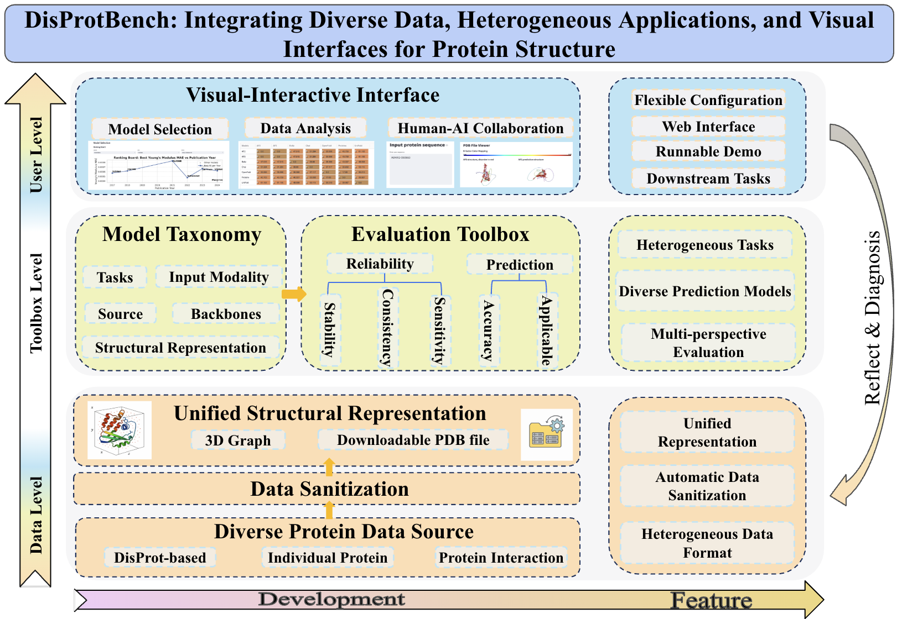
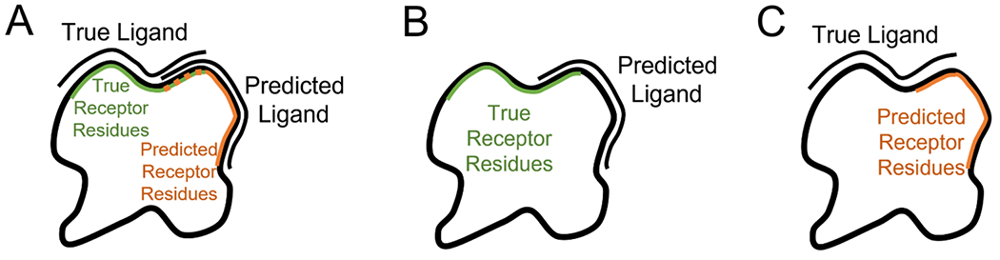
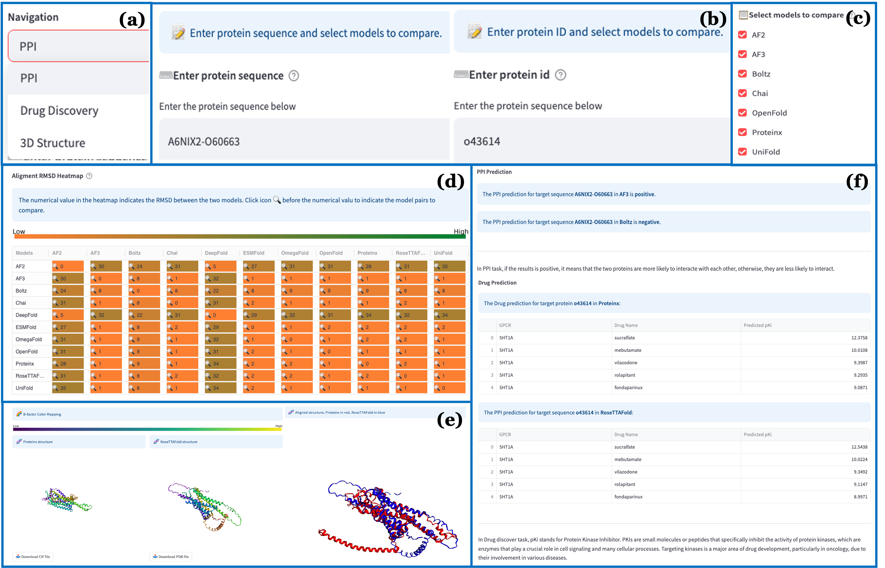
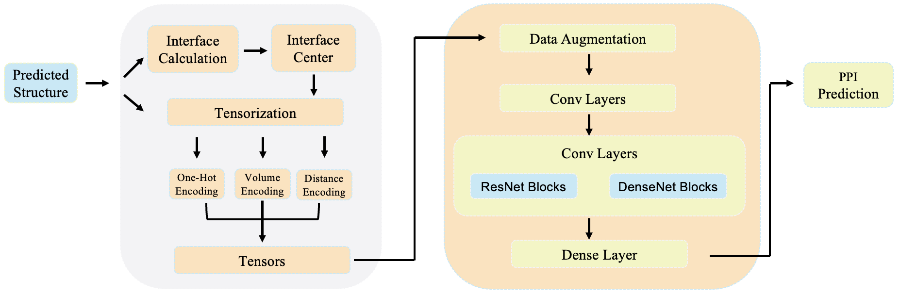
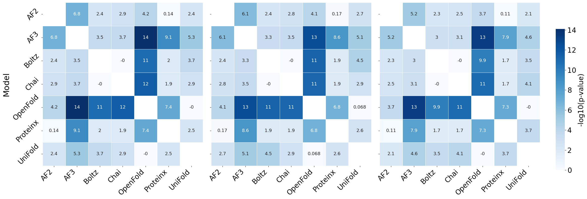
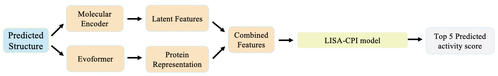
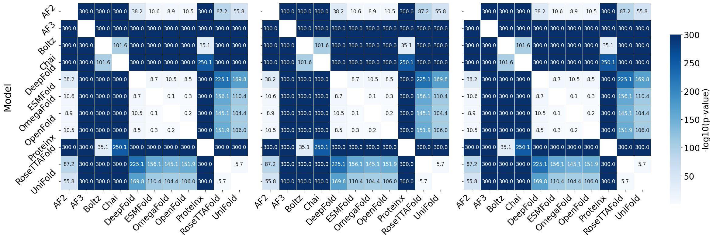

<div align="center">

# 🚀 `DisProtBench`:  Disorder-Aware, Task-Rich Benchmark for Evaluating Protein Structure Prediction in Realistic Biological Contexts

**Xinyue Zeng¹**, **Tuo Wang¹**, **Adithya Kulkarni⁵**, **Alexander Lu¹**, **Alexandra Ni¹**, **Phoebe Xing¹**, **Junhan Zhao²³**, **Siwei Chen²⁴**, **Dawei Zhou¹**

¹ Virginia Tech, ² University of Chicago ³ Harvard Medical School, ⁴ Broad Institute of MIT and Harvard, ⁵ Ball State University

<!-- Stylish Buttons -->
<p>
  
</p>

</div>

---

## 📌 Abstract
Recent advances in protein structure prediction have achieved near-atomic accuracy for well-folded proteins, but their reliability in biologically realistic settings involving intrinsically disordered regions (IDRs) remains poorly understood. Existing benchmarks primarily emphasize global structural accuracy and therefore fail to capture how structural uncertainty propagates to downstream functional tasks such as protein–protein interaction (PPI) prediction and structure-based drug discovery.

In realistic biological settings, evaluating protein structure prediction models (PSPMs) is challenging due to three fundamental factors:

- **Structural complexity:** Proteins often contain extensive IDRs, flexible segments, and multimeric interfaces that violate assumptions of rigid folding.
- **Low availability of reliable ground truth:** Reliable experimental structures are scarce for disordered regions, making direct structural evaluation unreliable.
- **Prediction uncertainty:** Structural uncertainty propagates into downstream prediction uncertainty, leading to task-dependent degradation in functional performance.

We introduce **DisProtBench**, an IDR-centric, uncertainty-aware benchmark for evaluating PSPMs beyond static accuracy. DisProtBench integrates a large, multi-modal dataset spanning disease-associated IDRs, GPCR–ligand complexes, and multimeric protein assemblies, and evaluates models through downstream functional tasks. To explicitly diagnose uncertainty, we introduce **Functional Uncertainty Sensitivity (FUS)**, which stratifies evaluation by task-relevant structural uncertainty rather than confidence alone.

Our results reveal clear task-dependent failure modes: PPI prediction is highly sensitive to IDR-driven uncertainty, whereas structure-based drug discovery remains comparatively robust. These differences are largely obscured by aggregate accuracy metrics. DisProtBench provides a reproducible and extensible framework for uncertainty-aware evaluation of protein structure prediction models in realistic biological contexts.

### 🔹 `DisProtBench` - A Unified Benchmark for IDR Investigation
We introduce DisProtBench with the following key contributions:

(1) **Database Development:** We curate a large benchmark dataset spanning biologically complex IDR scenarios, including thousands of disease-associated human proteins, GPCR–ligand interactions, and multimeric complexes with disorder-mediated interfaces. It captures structural heterogeneity essential for assessing model robustness in realistic contexts.

(2) **IDR-centric Toolbox Development:** We introduce a unified evaluation toolbox that benchmarks eleven PSPMs on disorder-sensitive downstream tasks, including PPI prediction and drug discovery, using consistent classification, regression, and structural interface metrics. Evaluation is performed via *Functional Uncertainty Sensitivity (FUS)*, which stratifies predictions by task-relevant structural uncertainty rather than confidence alone, enabling diagnosis of task-dependent failure modes across model families.

(3) **Visual Analystics Interface Development:** The DisProtBench Portal provides 3D visualizations, model comparison heatmaps, and interactive results to explore structure–function links, assess disorder-specific performance, and support hypothesis generation—without local setup.

## 📂 Datasets
We open-sourced our benchmark on Github here, consisting of the following subsets:

| **Dataset**                  | **Description**                   | **# Number of Protein Only** | **Source**                                                                 |
|-----------------------------|-----------------------------------|---------------|---------------------------------------------------------------------------|
| **DisProt-Based Dataset**   | Disorder in human disease         | $\sim 10^3$ proteins / $\sim$10$^4$ PPIs        | First proposed in our work                                                |
| **Protein Interaction Dataset** | Disorder-mediated interfaces      |$\sim 10^5$ interactions   | [GitHub](https://github.com/ohuelab/SpatialPPI/tree/main)                |
| **Individual Protein Dataset** | Disorder and ligand binding       | $\sim 10^3$ complexes | [GitHub](https://github.com/ChengF-Lab/LISA-CPI?tab=readme-ov-file)       |
              
## 🏗️ Toolbox
### 📂 Models Toolbox
We benchmark state-of-the-art PSPMs spanning diverse architectures, inputs, and structural representations across protein-related tasks, as summarized below:

<div align="center">

| **PSPM**       | **Task**       | **Architecture**     | **Input**       | **Source**         | **Structural Representation**                |
|----------------|----------------|-----------------------|------------------|---------------------|------------------------|
| AF2            | PPI, Drug      | Evoformer             | MSA              | [Paper](https://www.nature.com/articles/s41586-021-03819-2)            | Atomic                 |
| AF3            | PPI, Drug      | Evoformer+LLM         | MSA + Seq        | [Paper](https://www.nature.com/articles/s41586-024-07487-w)            | Atomic + ligand        |
| OpenFold       | PPI, Drug      | Evoformer             | MSA              | [Paper](https://www.nature.com/articles/s41592-024-02272-z)               | Atomic                 |
| UniFold        | PPI, Drug      | Evoformer             | MSA              | [Paper](https://www.biorxiv.org/content/10.1101/2022.08.04.502811v3)        | Atomic                 |
| Boltz          | PPI, Drug      | Transformer           | Seq-only         | [Paper](https://www.biorxiv.org/content/10.1101/2024.11.19.624167v4)      | Coarse-grained         |
| Chai           | PPI, Drug      | Transformer           | Seq-only         | [Paper](https://www.biorxiv.org/content/10.1101/2024.10.10.615955v1)      | Coarse-grained         |
| Protenix       | PPI, Drug      | Transformer+          | Seq-only         | [Paper](https://www.biorxiv.org/content/10.1101/2025.01.08.631967v1)           | Atomic + ligand        |
| ESMFold        | Drug           | Transformer           | Seq-only         | [Paper](https://www.biorxiv.org/content/10.1101/2022.07.20.500902v3)             | Coarse-grained         |
| OmegaFold      | Drug           | Transformer           | Seq-only         | [Paper](https://www.biorxiv.org/content/10.1101/2022.07.21.500999v1)             | Coarse-grained         |
| RoseTTAFold    | Drug           | Hybrid (CNN+Attn)     | MSA              | [Paper](https://pubmed.ncbi.nlm.nih.gov/34282049/)           | Atomic                 |
| DeepFold       | Drug           | Custom DL             | Seq-only         | [Paper](https://pubmed.ncbi.nlm.nih.gov/37995286/)       | Atomic                 |
</div>

### 📊 Evaluation ToolBox
We evaluate model performance using a comprehensive set of classification, regression, and structural interface metrics, defined as follows:

<div align="center">
  
| **Metric**                         | **Definition / Formula**    | **Categorization**    | 
|-----------------------------------|---------------------------------------------------------------------------------------------------------------|-------------------------------------------------------------------------------------------------------------|
| Precision (Positive Predictive Value) | TP / (TP + FP)     |  Classification Metrics        |
| Recall (Sensitivity)              | TP / (TP + FN)    |  Classification Metrics      |
| F1 Score                          | 2 × TP / (2 × TP + FP + FN)    |  Classification Metrics        |
| Accuracy                          | (TP + TN) / (TP + TN + FP + FN)    |  Classification Metrics        |
| Mean Absolute Error (MAE)         | $\displaystyle \frac{1}{N}\sum_{i=1}^{N}\lvert y_i-\hat{y}_i\rvert$   | Regression Metrics           |
| Mean Squared Error (MSE)          | $\displaystyle \frac{1}{N}\sum_{i=1}^{N}\bigl(y_i - \hat{y}_i\bigr)^2$   | Regression Metrics            |
| Pearson Correlation Coefficient (R) | Σ[(yᵢ − ȳ)(ŷᵢ − ŷ̄)] / √(Σ(yᵢ − ȳ)² × Σ(ŷᵢ − ŷ̄)²)| Regression Metrics           |
| Receptor Precision (RP)           | `size(True ∩ Pred Receptor) / size(Pred Receptor)`  | Structural Interface Metrics  |     
| Receptor Recall (RR)              | `size(True ∩ Pred Receptor) / size(True Receptor)`   | Structural Interface Metrics |     
| Ligand Precision (LP)             | `size(Pred Ligand ∩ True Receptor) / size(Pred Ligand)`    | Structural Interface Metrics  |     
| Ligand Recall (LR)                | `size(True Ligand ∩ Pred Receptor) / size(True Ligand)`  | Structural Interface Metrics |     
</div>

For the definitions of Receptor and Ligand, we follow the work of *Multi-level analysis of intrinsically disordered protein docking methods*:

<p align="center">  </p>

## 🎨 Visualize Portal
For more visualizations, please link to 

🔗 **Visual-Interactive Interface**: DisProtBench Portal

<p align="center">  </p>

## 🏗️ Results
### PPI Prediction
#### Generation Evaluation
The table below summarizes RR, RP, LR, and LP scores with 95% CI for each PSPM across three structural confidence thresholds (full sequence, $\mathrm{FUS}_T(\tau=30)$, and $\mathrm{FUS}_T(\tau=50)$), highlighting interface prediction performance under varying disorder levels:

|   | **Original**        |      |        |       | **$\mathrm{FUS}_T(\tau=30)$**        |      |     |         |**$\mathrm{FUS}_T(\tau=50)$**        |        |        |         |
|-------------|---------------------|---------------------|---------------------|---------------------|---------------------|---------------------|---------------------|---------------------|---------------------|---------------------|---------------------|---------------------|
| **PSPM**   | **RR**       | **RP**       | **LR**       | **LP**       | **RR**        | **RP**        | **LR**        | **LP**        | **RR**        | **RP**        | **LR**        | **LP**        |
| AF2         | 0.749 ± 0.0217      | 0.7186 ± 0.0226     | 0.7052 ± 0.0215     | 0.7486 ± 0.0215     | 0.7729 ± 0.0208     | 0.7426 ± 0.0217     | 0.7313 ± 0.0207     | 0.7719 ± 0.0204     | 0.7959 ± 0.0197     | 0.7663 ± 0.0207     | 0.7569 ± 0.0198     | 0.7946 ± 0.0193     |
| Boltz       | 0.7648 ± 0.0155     | 0.7666 ± 0.0153     | 0.7703 ± 0.0155     | 0.7624 ± 0.0140     | 0.7876 ± 0.0147     | 0.7899 ± 0.0146     | 0.7934 ± 0.0148     | 0.7863 ± 0.0142     | 0.8098 ± 0.0139     | 0.8121 ± 0.0138     | 0.8152 ± 0.0140     | 0.8093 ± 0.0134     |
| Chai        | 0.7583 ± 0.0158     | 0.7746 ± 0.0149     | 0.7674 ± 0.0155     | 0.7571 ± 0.0155     | 0.7815 ± 0.0150     | 0.7980 ± 0.0142     | 0.7898 ± 0.0147     | 0.7804 ± 0.0148     | 0.8034 ± 0.0142     | 0.8203 ± 0.0134     | 0.8117 ± 0.0139     | 0.8029 ± 0.0140     |
| OpenFold    | 0.6626 ± 0.0271     | 0.6127 ± 0.0312     | 0.6551 ± 0.0274     | 0.6322 ± 0.0280     | 0.6904 ± 0.0263     | 0.6386 ± 0.0306     | 0.6828 ± 0.0267     | 0.6593 ± 0.0272     | 0.7182 ± 0.0254     | 0.6644 ± 0.0297     | 0.7111 ± 0.0258     | 0.6861 ± 0.0263     |
| Proteinx    | 0.7344 ± 0.0164     | 0.7427 ± 0.0162     | 0.7385 ± 0.0159     | 0.7310 ± 0.0159     | 0.7584 ± 0.0158     | 0.7658 ± 0.0155     | 0.7626 ± 0.0152     | 0.7544 ± 0.0155     | 0.7811 ± 0.0150     | 0.7884 ± 0.0147     | 0.7857 ± 0.0144     | 0.7775 ± 0.0144     |
| UniFold     | 0.5876 ± 0.0593     | 0.5431 ± 0.0604     | 0.5892 ± 0.0711     | 0.6116 ± 0.0609     | 0.6127 ± 0.0576     | 0.5671 ± 0.0590     | 0.6172 ± 0.0707     | 0.6384 ± 0.0595     | 0.6386 ± 0.0557     | 0.5923 ± 0.0576     | 0.6426 ± 0.0689     | 0.6655 ± 0.0578     |

#### Prediction Evaluation
We use PPI prediction as a downstream task for evaluating PSPMs with the following pipeline:

<p align="center">  </p>

We examine the robustness of PSPMs in predicting PPI, a setting where disordered regions frequently mediate transient or flexible binding. The results are as follows:

<div align="center">
  
|          | **Original** |          |         |        | **$\mathrm{FUS}_T(\tau=30)$** |          |         |        | **$\mathrm{FUS}_T(\tau=50)$** |          |         |        |
| -------- | ------------ | -------- | ------- | ------ | -------------- | -------- | ------- | ------ | -------------- | -------- | ------- | ------ |
| **PSPM** | **Acc**      | **Prec** | **Rec** | **F1** | **Acc**        | **Prec** | **Rec** | **F1** | **Acc**        | **Prec** | **Rec** | **F1** |
| AF2      | 0.793        | 0.783    | 0.799   | 0.791  | 0.802          | 0.791    | 0.812   | 0.801  | 0.818          | 0.809    | 0.825   | 0.817  |
| AF3      | 0.902        | 0.888    | 0.915   | 0.901  | 0.905          | 0.893    | 0.905   | 0.906  | 0.913          | 0.899    | 0.930   | 0.914  |
| Boltz    | 0.850        | 0.848    | 0.853   | 0.850  | 0.858          | 0.853    | 0.863   | 0.858  | 0.869          | 0.870    | 0.868   | 0.869  |
| Chai     | 0.850        | 0.841    | 0.863   | 0.852  | 0.858          | 0.847    | 0.873   | 0.860  | 0.869          | 0.857    | 0.887   | 0.871  |
| OpenFold | 0.624        | 0.605    | 0.605   | 0.605  | 0.643          | 0.622    | 0.638   | 0.630  | 0.671          | 0.656    | 0.651   | 0.653  |
| Proteinx | 0.810        | 0.809    | 0.812   | 0.810  | 0.819          | 0.820    | 0.818   | 0.819  | 0.834          | 0.834    | 0.835   | 0.834  |
| UniFold  | 0.552        | 0.378    | 0.667   | 0.483  | 0.567          | 0.389    | 0.667   | 0.491  | 0.597          | 0.417    | 0.714   | 0.526  |
</div>

**Heatmaps** of -log10(p) values from McNemar tests comparing pairwise model performance on PPI prediction across different $\mathrm{FUS}_T(\tau)$. **Left**: full sequence; **Middle**: $\mathrm{FUS}_T(\tau=30)$; **Right**: $\mathrm{FUS}_T(\tau=50)$. Higher values indicate greater statistical significance between PSPMs. Blank blocks indicate self-comparisons, which are omitted by definition.

<p align="center">  </p>

### Drug Discovery
#### Prediction Evaluation
We use drug discovery as a downstream task for evaluating PSPMs with the following pipeline:

<p align="center">  </p>

We examine the robustness of PSPMs in discovering drugs, a setting where disordered regions frequently mediate transient or flexible binding. The results are as follows:

<div align="center">
  
|             | **Original** |       | **$\mathrm{FUS}_T(\tau=30)$** |       | **$\mathrm{FUS}_T(\tau=50)$** |       |
| ----------- | ------------ | ----- | -------------- | ----- | -------------- | ----- |
| **Model**   | **MAE**      | **R** | **MAE**        | **R** | **MAE**        | **R** |
| AlphaFold3  | 0.048        | 0.999 | 0.048          | 0.999 | 0.049          | 0.999 |
| Proteinx    | 0.072        | 0.997 | 0.072          | 0.997 | 0.072          | 0.997 |
| Boltz       | 0.079        | 0.996 | 0.079          | 0.996 | 0.080          | 0.996 |
| Chai        | 0.096        | 0.995 | 0.096          | 0.995 | 0.097          | 0.995 |
| DeepFold    | 0.144        | 0.988 | 0.144          | 0.988 | 0.144          | 0.988 |
| ESMFold     | 0.150        | 0.987 | 0.150          | 0.987 | 0.151          | 0.987 |
| OmegaFold   | 0.151        | 0.987 | 0.151          | 0.987 | 0.152          | 0.987 |
| OpenFold    | 0.151        | 0.987 | 0.151          | 0.987 | 0.151          | 0.987 |
| AlphaFold2  | 0.160        | 0.985 | 0.160          | 0.985 | 0.160          | 0.985 |
| UniFold     | 0.183        | 0.981 | 0.183          | 0.981 | 0.184          | 0.981 |
| RoseTTAFold | 0.190        | 0.979 | 0.190          | 0.979 | 0.190          | 0.979 |
</div>

**Heatmaps** of -log10(p) values from Wilcoxon signed-rank tests comparing model performance in drug discovery tasks across different $\mathrm{FUS}_T(\tau)$. **Left**: full sequence; **Middle**: $\mathrm{FUS}_T(\tau=30)$; **Right**: $\mathrm{FUS}_T(\tau=50)$. Higher values indicate greater statistical significance in pairwise differences between PSPMs. Blank blocks indicate self-comparisons, which are omitted by definition.

<p align="center">  </p>

## Folder Structure

```
DisProtBench/
│
├── Database/
│   ├── DisProt-based Datase/         # Scripts for extracting and processing DisProt-based data
│   ├── Protein Interaction Dataset/  # Main dataset files (e.g., dataset1200.json)
│   └── Individual Protein Datase/    # Scripts for individual protein data (e.g., GPCRs)
│
├── Downstream Evaluation/
│   ├── toolbox/                      # Unified CLI and utility scripts for evaluation tasks
│   ├── PPI/                          # PPI task scripts (preprocessing, training, testing)
│   └── CPI-drug discovery/           # CPI/drug discovery task scripts and AlphaFold tools
│
├── disprotbenchmark-metadata.json    # Metadata and dataset description
├── LICENSE                          # Project license (MIT)
└── README.md                        # This file
```

## Getting Started

### Prerequisites

- Python 3.7+
- [TensorFlow](https://www.tensorflow.org/) (for PPI tasks)
- [PyTorch](https://pytorch.org/) (for CPI tasks)
- [AlphaFold dependencies](https://github.com/deepmind/alphafold) (for structure-based tasks)
- Other dependencies: numpy, pandas, scikit-learn, tqdm, biopython, jax, etc.

For AlphaFold-related tasks, install dependencies from:
```
Downstream Evaluation/toolbox/cpi/alphafold/requirements.txt
```

Example (in a new environment):
```bash
pip install -r Downstream\ Evaluation/toolbox/cpi/alphafold/requirements.txt
```

### Installation

Clone the repository and install the required dependencies for your tasks of interest.

## Usage

### Unified CLI for Downstream Tasks

All major PPI and CPI tasks can be run from a single entry point:

```bash
cd Downstream\ Evaluation/toolbox
python toolbox.py <ppi|cpi> <subcommand> [options]
```

#### PPI Tasks

- **Train a PPI model:**
  ```bash
  python toolbox.py ppi train \
    --model DenseNet3D \
    --datapath ./data/example_dataset/distance \
    --train_set ./data/example_dataset/part_0_train.csv \
    --test_set ./data/example_dataset/part_0_val.csv \
    --savingPath ./models/example_model
  ```

- **Test a PPI model:**
  ```bash
  python toolbox.py ppi test \
    --model DenseNet3D \
    --datapath ./data/example_dataset/distance \
    --weights ./models/example_model/<timestamp>/best_model.weights.h5 \
    --output ./models/example_model/<timestamp>/preds.npy \
    --test_set ./data/example_dataset/part_0_test.csv
  ```

#### CPI/Drug Discovery Tasks

- **Prepare CPI dataset:**
  ```bash
  python toolbox.py cpi prepare_data --dataset data/original/top20_raw.csv --gpcr-col uniprot_id --smiles-col smiles --label-col pKi --file-name-col inchi_key --rep-path data/representations/top20/{}.npy --save-path data/ligands/top20/imgs --anno-path data/ligands/top20/anno -j 12 --test-size 0.3 --task regression
  ```

- **Train a CPI model:**
  ```bash
  python toolbox.py cpi train --cfg configs/train/top20.yml
  ```

- **Predict with a CPI model:**
  ```bash
  python toolbox.py cpi predict --cfg configs/prediction/pain.yml --data-dir data/pred/fda --rep-path data/representations/pain/P08908.npy --out-dir output/prediction/fda/P08908
  ```

#### Protein Structure Prediction

For generating protein structure, see the instructions of the models directly.

---

## License

This project is licensed under the MIT License. See the [LICENSE](LICENSE) file for details.

## References
- [LISA-CPI GitHub](https://github.com/ChengF-Lab/LISA-CPI?tab=readme-ov-file)
- [SpatialPPI GitHub](https://github.com/ohuelab/SpatialPPI/tree/main)
- [AlphaFold GitHub](https://github.com/deepmind/alphafold)
- [*Multi-level analysis of intrinsically disordered protein docking methods*](https://pubmed.ncbi.nlm.nih.gov/35609776/)
